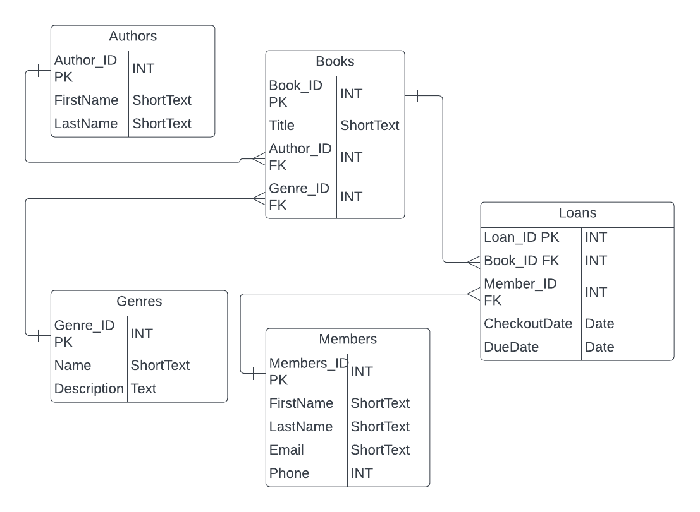
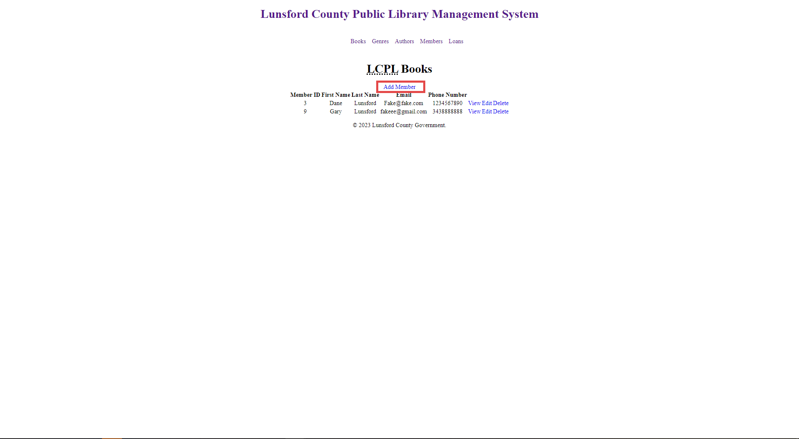
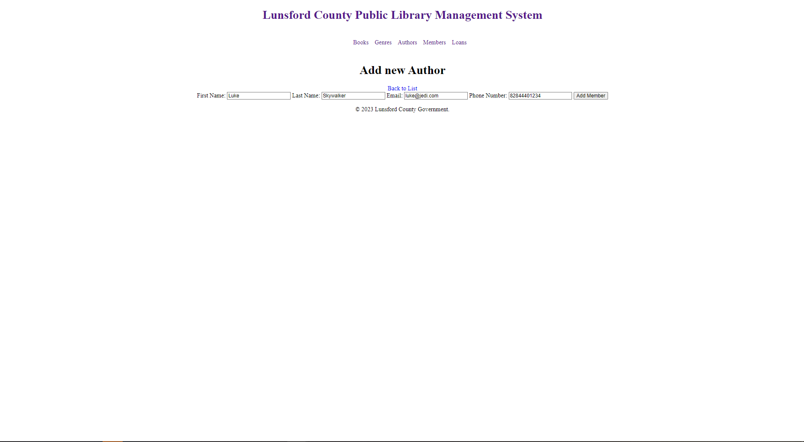
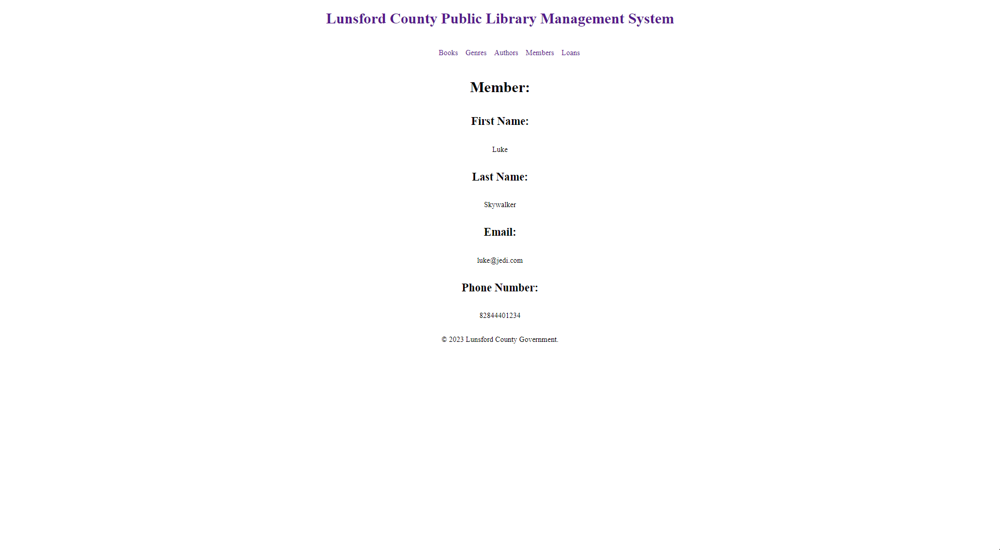
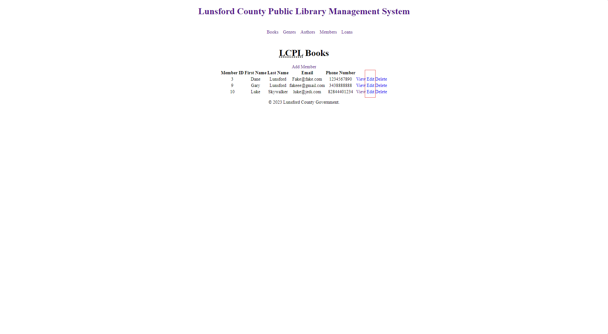
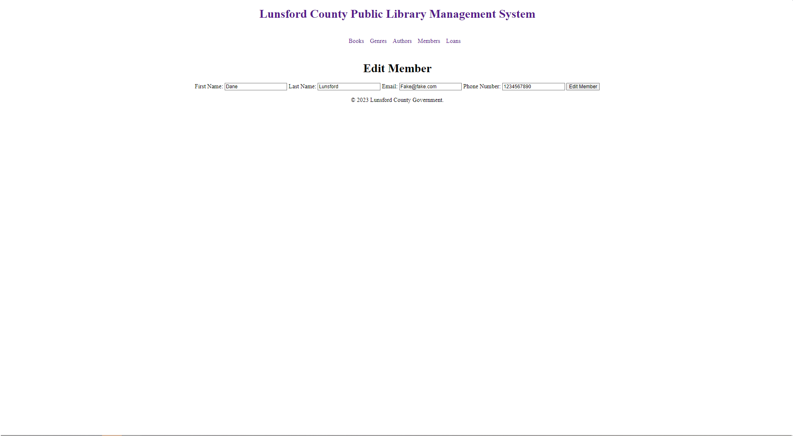
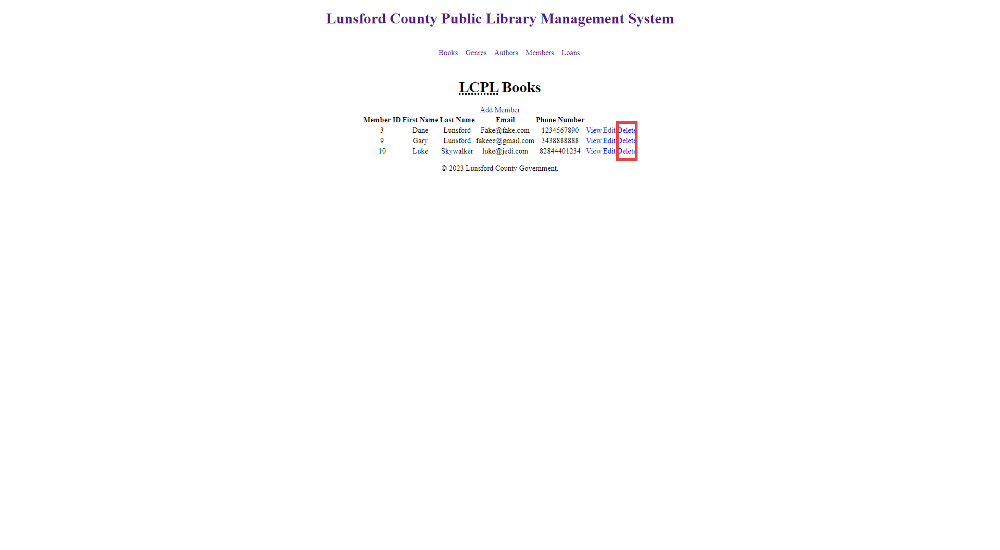
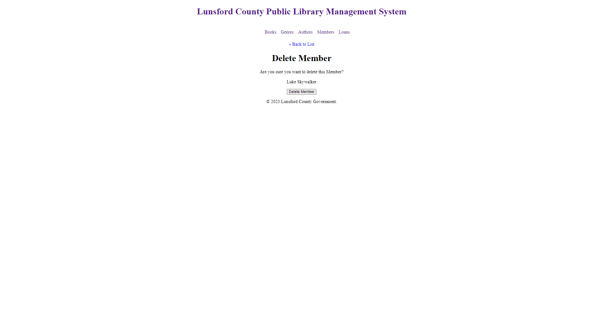
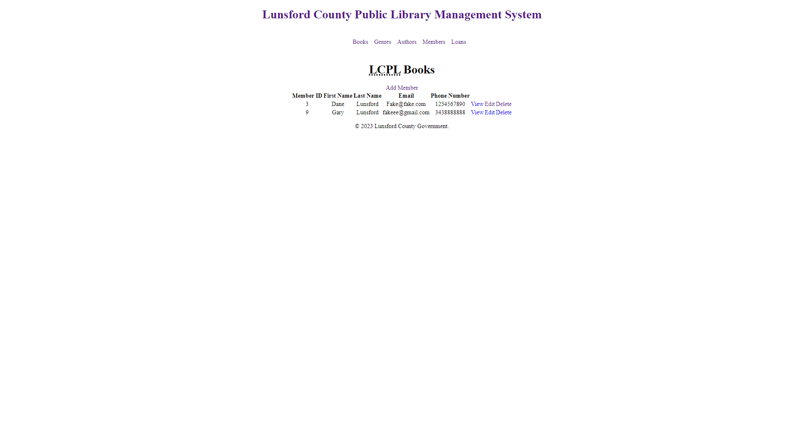

# DBA-120-FinalProject
 Final Project for DBA-120
## Purpose of Project
 This database project should be able to maintain a local library and help with inventory and member tracking.

 ## ERD
 

 # CRUD OPERATIONS
 Here are some screenshots of some of the CRUD Operations preformed on the members table. Note that these screenshots were used on a local database so they do not reflect the online database

 ## Create OP
 
 The Highlighted Link takes you to the create member screen below.
 
 Here you can enter the fields and click Add Member after filling out the fields.

## Read OP
 
 When you create the new record you are taken to a page that
 preforms a READ operation to display the information of the new record.
 
 Here are the read links to view each record. As well as this page uses a loop to read all the records in this table.
 

 ## Update OP
 
 Here are the links to edit/update the records
 
 This is the Form that the link brings you to. It pre-populates the fields with their current information and you can then edit as needed

 ## Delete OP
 
 Here are the links that take you to a form to delete a record
 
 Here is a form that uses a POST request to confirm the
 deletion
 
 The form then goes back to read the whole table. Note that the deleted record is no longer there.

 # Closing Notes
 I only did some VERY light styling and the pages aren't really responsive yet. I intend on fleshing out the styling as well as maybe implement some javascript to improve the experience of viewing records with filters and such.

 Everyone is Free to use and distribute this code.

